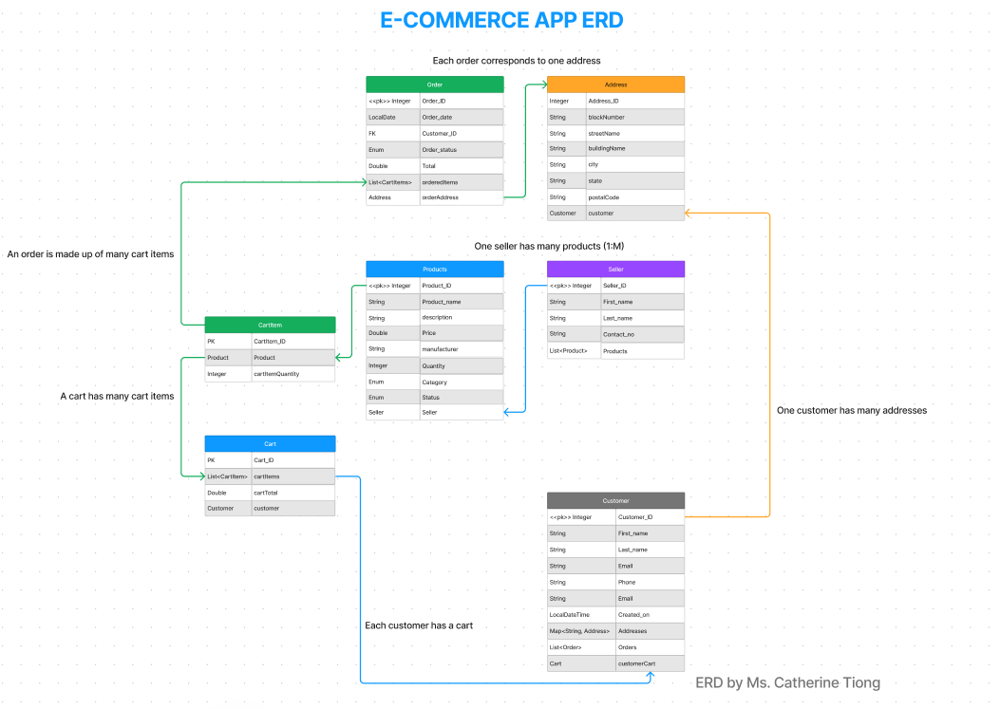

# Ecommerce App
This ecommerce app is powered by Java Spring Boot and features 7 entities to operate a functional ecommerce backed server. This project was coded to the design of the ERD below.

Entity Relationship Diagram
---------------------------

Demonstration of the Ecommerce App
----------------------------

After implementing the 7 entities and its corresponding controller, service and repository layer, the dataloader is used to initialize the database with base data. This makes testing easier.

